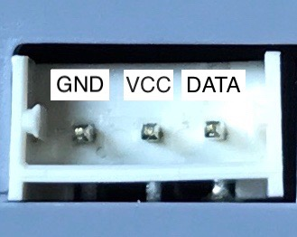
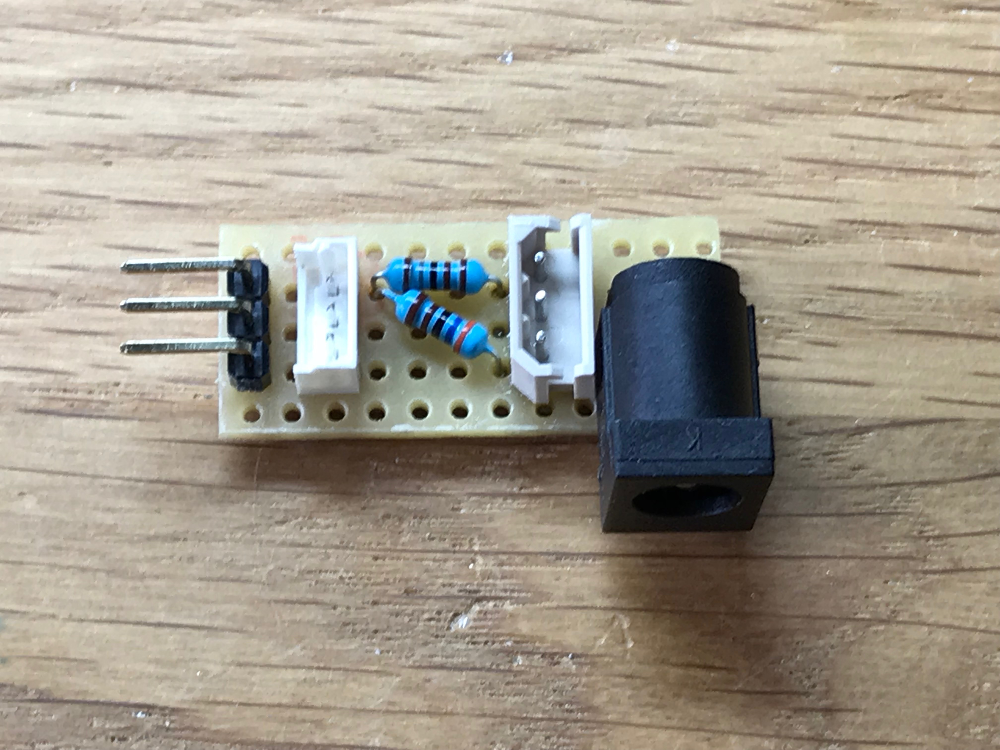

# Jimu Communication
[Jimu robots](www.jimurobots.com) use a daisy-chained bus to communicate between the controller and the peripheral devices (servos, sensors, etc.) similar in some aspects to the [Dynamixel servos](http://support.robotis.com/en/product/actuator/dxl_main.htm), but also quite different in many other aspects.

## Bus Hardware
The Jimu bus has 3 pins, like the [Dynamixel TTL](http://support.robotis.com/en/product/actuator/dynamixel/dxl_ax_main.htm) bus, using one single pin for bidirectional communication (semiduplex serial communication). The bus uses the same [MOLEX MicroLatch connector](http://support.robotis.com/en/product/actuator/dynamixel/dxl_connector.htm) as the XL-320 servos but please pay attention to the following 2 important differences:
* the contacts in the Jimu connector are switched between the GND and the DATA pin
>**Please be careful**: the official documentation from Robotis refers to the pins as 1, 2, 3 but does not use the same numbering convention as in the Molex documentation, so what Robotis calls pin 1 is in fact the pin 3 of the Molex connector!
* Jimu uses 3.3V logic for the data transmission, while Robotis uses 5V.
>Using a Robotis controller (USB2Dynanmixel for instance) and swapping the pins GND and DATA will not work because the Jimu devices have Zenner diodes on the inputs for protection and they will kick in.

Here is a picture with the pins marked:

If you want to use an existing Dynamixel controller you would need to use a voltage divider to deal with the voltage difference. A quick example, that can be used to connect a USB2Dynamixel is this one:

The connectors provide the swap between the GND and DATA, the resistors make the reduction from 5V to 3.3V and the power jack allows you to power the servos (USB2Dynamixel does not include a power supply).

## General Package Information
The controller connects with the devices using serial transfer and, different from the Dynamixel devices the communication is at **115,200 bps**.
> I have not found any indication that the devices support changing the communication speed like in the case of Dynamixel servos. You need to keep in mind this very severe limitation when designing robots as the number of packages that can be transmitted would be significantly lower than with Dynamixel servos.

Similar to Dynamixel communication, the Jimu package consists of a **header** (2 bytes), a **payload** (variable) usually including a **checksum**, and an **end marker** (1 byte). Different from the Dynamixel package, the header is different for different types of devices (servos, sensors, etc.) and sometimes also for the same device the header is different by message type (ex. for servo discovery -- the "ping" for Dynamixel devices). We will detail this later in this document.

All packages sent by the controller return a reply from the device. Some of these replies might be very simple (1 byte), others could be full formed packets with a structure similar to the message send by the controller.

> The following information has been obtained by sniffing the communication on the bus using a standard Jimu robot and using the iOS App to control the robot. Various instructions have been tried and the commands generated on the bus were analysed and in some cases reproduced later with an adapted controller when the environment in the iOS App was not capable to produce programs that would be satisfying for our testing needs. Therefore please consider this list as a starting point and understand that this is by no means complete or 100% accurate in respect to the abilities of the devices we are testing.

Dynamixel servos (Robotis does not really have any other devices that use the daisy-chain bus with the notable exception of the [AX-S1](http://support.robotis.com/en/product/auxdevice/sensor/dxl_ax_s1.htm)) use internal registers for communicating information between the controller and the device. The communication protocol allows you to write or read these registers, thus allowing you to give instructions or retrieve information from the sensors on that device (ex. temperature, position, etc.).

Jimu devices are more simple from this perspective and the messages encode directly the desired action. This will become more clear when you will look at the messages bellow.

## Servo Messages

### Message 0x01 - Go-To Position message

| Byte | Value  | Explanation                           |
|------|--------|---------------------------------------|
| 1    | 0xFA   | Header for Servo                      |
| 2    | 0xAF   | Header for Servo                      |
| 3    | ID     | ID of servo; must be between 1 and 32 |
| 4    | 0x01   | This is command = GOTO                |
| 5    | POS    | Desired position in degrees + 120     |
| 6    | DUR    | Duration of movement in ms / 20       |
| 7    | 0x00   | Not sure what this is used for yet    |
| 8    | 0x01   | Not sure when this is used for yet    |
| 9    | SUM    | Sum % 256 of bytes [3-8]              |
| 10   | 0xED   | Message end marker                    |

Some comments about the message parameters:
* the POS parameter indicates the desired position for the servo; Jimu the servos are limited to -120, 120 angle. A 0 value passed to this parameter will move the servo to -120 degrees. A value of 120 (0x78) will move the servo to position 0 (center) and a value of 240 (0xF0) will move the servo to 120 degrees. This also means that the lowest granularity for the commands are 1 degree increments (the Dynamixel have 1024 or 4096 steps over 350 or 360 degrees meaning a granularity of 0.34 respectively 0.088 degrees - but frankly all is determined by the available torque of the servo and the load; I found that getting 0.34 degrees accuracy with XL-320 is a hit and miss situation).
> I have not yet tried what happens if the number is outside this range

* the DUR parameter represents the timing of the move to the desired position in 20ms increments. So a 10 (0x0A) value in this field will represent a 20ms x 10 = 200ms duration for the movement.
>Theoretically the maximum duration for the movement is 255 x 20ms = 5,100ms = 5.1s. The iOS App limits this to 5s but I don't know if this is just a limitation in the App or the maximum allowed value in this field is 250 (0xFA).

* the SUM is a simple 256 mod over the payload of the message, similar to the Communication v1 in Dynamixel protocol.

**Answer**
The servo will answer with one single byte of information imediately after receiving the instruction:

| Byte | Value  | Explanation                           |
|------|--------|---------------------------------------|
| 1    | ANS    | = 0xAA + Servo ID                     |

If everything is fine the servo will answer 0xAA (everything is OK! - we'll see this repeated to other devices - although in a slightly different way) plus the servo ID. Thus if we sent the order to servo 1 the answer we will receive will be 0xAB. If the servo is 2 the answer will be 0xAC, and so on.
> I have not been able to receive an error yet to see what would a "not OK" message be like

### Message 0x02 - Get Position in Compliant Mode
A nice feature of the Dynamixel servos was that you could put them in a "compliant" mode whereby the torque was no longer applied and you could freely move the servos to a desired position. Reading that position would allow you to create moves directly by placing the robot in the desired positions and "learning" that stance.

This nice feature is also available to the Jimu servos. If in the case of Dynamixel the trigger was to write into the "Torque enable" register, in the case of Jimu servos this is accomplished by a dedicated message.

| Byte | Value  | Explanation                           |
|------|--------|---------------------------------------|
| 1    | 0xFA   | Header for Servo                      |
| 2    | 0xAF   | Header for Servo                      |
| 3    | ID     | ID of servo; must be between 1 and 32 |
| 4    | 0x02   | This is command = Read compliant      |
| 5    | 0x00   | Constant                              |
| 6    | 0x00   | Constant                              |
| 7    | 0x00   | Constant                              |
| 8    | 0x00   | Constant                              |
| 9    | SUM    | Sum % 256 of bytes [3-8]              |
| 10   | 0xED   | Message end marker                    |

The message contains 4 0x00 bytes after the command byte (0x02) that seem to be there because as a general rule all messages with the servo use 4 bytes as arguments.
> When this message is sent to the servo it immediately puts the servo in compliance mode and the horn becomes sensitive to any external adjustments. That being said when Dynamixel servos are in compliant mode the power is simply cut off from the motor and it behaves like a servo that has no power. The Jimu servos have a slightly different feel: the first moment when you try to move a servo there is some resistance as if the servo is still powered, but apply enough torque and the servo "softens" and you move is fluently to another position. I actually like this quite a lot because it allows the robot to be relatively stiff and maintain position when placed in compliant mode, something that is not happening with the Dynamixel servos. It's true that the accuracy of positioning the servo suffers in this case as you might have to go back and forth to arrive at the best reflection of your desired position, but at least you don't need to keep all the robot from not falling while you do that.

The servo answers in a different manner than in the case of the message 01 (goto position), specifically it answers with a full formed message on its own:

| Byte | Value  | Explanation                           |
|------|--------|---------------------------------------|
| 1    | 0xFA   | Header for Servo                      |
| 2    | 0xAF   | Header for Servo                      |
| 3    | ID     | ID of servo answering                 |
| 4    | 0xAA   | This means all OK                     |
| 5    | 0x00   | Constant                              |
| 6    | TAR    | Target position                       |
| 7    | 0x00   | Constant                              |
| 8    | POS    | Current position                      |
| 9    | SUM    | Sum % 256 of bytes [3-8]              |
| 10   | 0xED   | Message end marker                    |

The byte 4 is always 0xAA if all is OK, and not the 0xAA + ID as in the case of the answer for goto-position message.

The byte 6 - Target position - will give you the position of the last goto-position request that was sent to the servo before being placed in compliant mode.

The byte 8 - Current position follows the same rules as in the case of goto-position message (ie. the value there represents the position in degree + 120).

>**It is important to note that once a message 0x02 is send to the servo it will stay in compliant mode until a message 0x01 is issued.**
